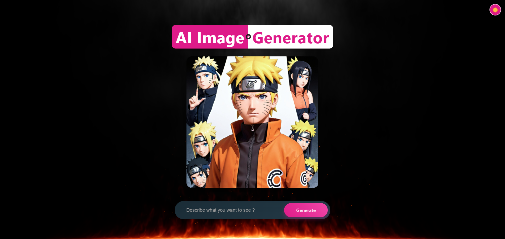
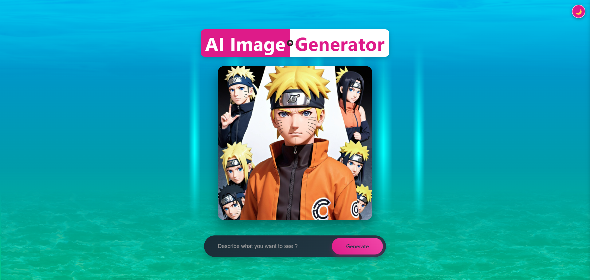

# 🤖🖼️ AI Image Generator [[Live Preview](https://ai-image-generator-live.netlify.app/)]

A web app that turns your text descriptions into images using AI. Switch between cool fire and water themes while you create.

#### Preview





<br>

## ✨ Features

### 🎯 Core Functionality

- 🤖 AI-powered image generation
- 💬 Text-to-image conversion
- 🌓 Dark/Light theme toggle
- ✨ Interactive UI animations
- 📱 Fully responsive design

### 🎨 User Experience

- 🔥 Fire theme background
- 💧 Water theme background
- ✨ Button shine effects
- 🖱️ 3D tilt interactions
- ⌨️ Keyboard shortcuts (Enter key)
- 🔄 Loading animations

<details>
<summary>View Sample Generations</summary>
 

  
  
    


</details>

<br>

## 🛠️ Tech Stack

### Core Technologies

- ⚛️ React
- 🔄 Vite
- 🎨 CSS3 with advanced animations
- 🤖 AI Image Generation API
- 🌐 RESTful API integration
- 🎭 React Context API for theming

<br>

## 🚀 Getting Started

### Prerequisites

- Node.js (v14 or higher)
- npm or yarn
- API key for image generation

### Installation

1. Clone the repository:
   ```sh
   git clone https://github.com/VinayShetyeOfficial/ai-image-generator.git
   ```
2. Navigate to the project directory:
   ```sh
   cd ai-image-generator
   ```
3. Install dependencies:
   ```sh
   npm install
   ```
4. Create a `.env` file with your API key:
   ```
   VITE_STABILITY_API_KEY_1=your_api_key_here
   ```
5. Start the development server:
   ```sh
   npm run dev
   ```

<br>

## 📁 Project Structure

```
ai-image-generator/
│── public/
│   ├── favicons/
│   │   └── image-bg-fire.png
│   └── water-bg.html
│── src/
│   ├── components/
│   │   └── image_generator/
│   │       ├── ImageGenerator.jsx
│   │       └── ImageGenerator.css
│   ├── assets/
│   ├── App.jsx
│   ├── ThemeContext.jsx
│   ├── ThemeBackground.jsx
│   ├── FireBackground.jsx
│   ├── WaterBackground.jsx
│   ├── index.css
│   └── main.jsx
├── .env
├── index.html
├── package.json
└── README.md
```

<br>

## 🤝 Contributing

Feel free to fork this project and make it your own. If you have ideas to make it better:

1. Fork it
2. Create your feature branch (`git checkout -b feature/cool-new-feature`)
3. Commit your changes (`git commit -m 'Add some cool feature'`)
4. Push to the branch (`git push origin feature/cool-new-feature`)
5. Open a Pull Request

<br>

> [!NOTE]  
> This app uses AI to generate images from text descriptions. Results may vary based on the prompts you provide.

<br>

## 📧 Contact

Vinay Shetye - [GitHub](https://github.com/VinayShetyeOfficial) - vinay.shetye.personal@outlook.com <br>
Project Link: [https://github.com/VinayShetyeOfficial/ai-image-generator](https://github.com/VinayShetyeOfficial/ai-image-generator)
